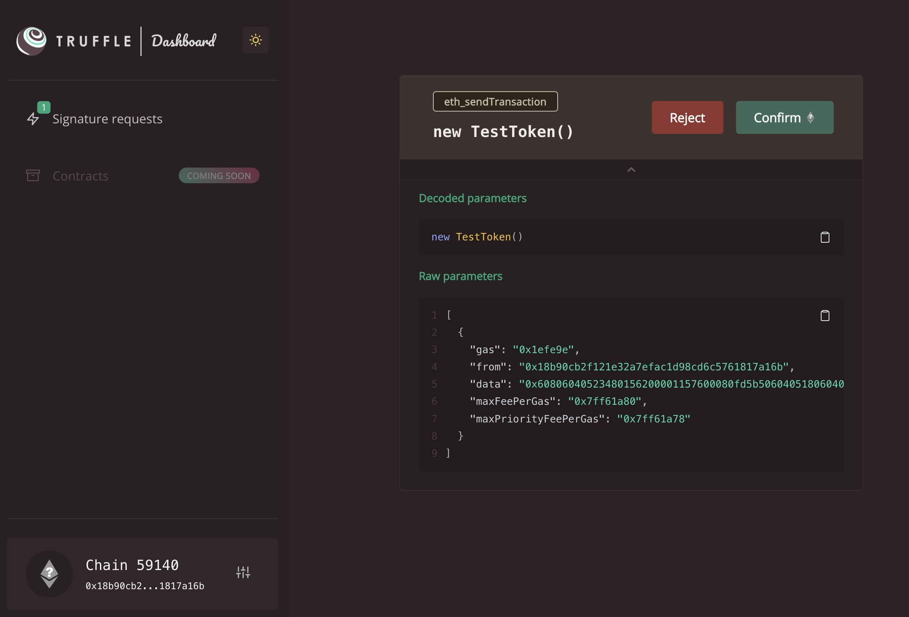

# @truffle/dashboard-hardhat-plugin

> No more private keys inside `.env` files! Truffle Dashboard lets you sign
> messages with MetaMask and provides insights for better dapp development.
> :lock:

This plugin makes it easy to access all the features of
[Truffle Dashboard](https://trufflesuite.com/docs/truffle/how-to/use-the-truffle-dashboard/),
including better security and high-quality transaction decoding.

## Summary

This plugin automatically adds a `--network truffleDashboard` to your Hardhat
project and tells Truffle Dashboard all the information it needs about your
smart contracts.

If you're used to Truffle Dashboard without this plugin, you'll notice that this
plugin enables you to see decoded transactions (i.e., function name and all
argument values). Compare before vs. after installing this plugin:


@truffle/dashboard-hardhat-plugin works by hooking into `npx hardhat compile`;
every time you compile your project, this plugin takes the resulting build-info
and sends it to Truffle Dashboard. Under the hood, Truffle Dashboard uses the
advanced
[@truffle/decoder](https://trufflesuite.com/docs/truffle/codec/modules/_truffle_decoder.html)
library to decode your smart contract operations, giving you improved visibility
before you issue a signature with your browser-based wallet.

Besides just relaying project info to Truffle Dashboard, this plugin also
eliminates the need to add a custom network to your config. Instead, it
automatically adds the `truffleDashboard` network for you, so you don't need to
note the JSON-RPC `url`, etc.

Please see below if you're looking to customize network settings (like `timeout`
or `httpHeaders`, if these are things you need). Otherwise, keep reading to
learn how to get started. Enjoy!

## Installation

You can install this plugin with `npm` (or `yarn`) by running:

```console
npm install --save-dev @truffle/dashboard-hardhat-plugin
```

Then simply import the plugin in your `hardhat.config.ts`:

```typescript
import "@truffle/dashboard-hardhat-plugin";
```

## Setup

This plugin assumes you have Truffle installed (either globally or in a local
project context). If not, you can install it with `npm i -g truffle`. Beyond
this you'll be able to start Truffle Dashboard with `truffle dashboard`. For
reference, more information on using the Truffle Dashboard can be found
[here](https://trufflesuite.com/docs/truffle/how-to/use-the-truffle-dashboard/).

Alternatively, you can skip the installation and fetch (and run) it remotely
with `npx truffle dashboard`.

This plugin automatically tells Hardhat about the `truffleDashboard` network, so
you don't need to add this network to your `hardhat.config.ts` yourself. This
means you can get started quickly by just specifying
`--network truffleDashboard` when running your usual Hardhat commands (e.g.
`npx hardhat run ./scripts/deploy-contracts.ts --network truffleDashboard`).
This managed network includes the `url` property (default
`"http://localhost:24012/rpc"`) and a few other sensible defaults for this
workflow.

If you don't like this plugin's default network configuration (is
`--network truffleDashboard` too long?), then please see the next section for
information on how to modify this.

**Note on request timeouts**: Signing transactions with MetaMask is slower than
Hardhat's computing signatures automatically. For this reason,
@truffle/dashboard-hardhat-plugin disables request timeouts for the
`truffleDashboard` network. You can override this if you want the timeout anyway
(see below!).

### Configuration

> ℹ️ **This section is only about configuring this plugin.** If you want to
> customize Truffle Dashboard itself (e.g., custom host or port), then please
> ensure you have a `truffle-config.js` file with your preferred settings in
> your Hardhat project directory. See the
> [truffle-config.js#dashboard](https://trufflesuite.com/docs/truffle/reference/configuration/#dashboard)
> reference docs to learn more.

To customize @truffle/dashboard-hardhat-plugin, add a `truffle` section to your
Hardhat config. This namespace can contain the following fields (both are
optional):

- **`dashboardNetworkName`** _(default: `"truffleDashboard"`)_: Specify the name
  of the Truffle Dashboard network, e.g. via the `--network <...>` command-line
  option.

- **`dashboardNetworkConfig`**: A subset of the usual Hardhat network
  configuration settings.

  You can use this to override managed network behavior for any fields
  documented by Hardhat's
  [JSON-RPC based networks](https://hardhat.org/hardhat-runner/docs/config#json-rpc-based-networks)
  reference **except** `chainId`, `from`, `accounts`, and `url`. (This plugin
  supplies `url`; the other three fields are meaningless in the Truffle
  Dashboard signing workflow.)

  All `dashboardNetworkConfig` properties are optional. The following field has
  a different default than what Hardhat normally provides:

  - **`timeout`** _(default: `0`; i.e., no timeout)_: Hardhat's normal default
    value for this is `40000` (40 seconds)

## Usage

Assuming the above is all looking good, any subsequent compilations via
`npx hardhat compile` will send the compiled artifacts to Truffle Dashboard.
Subsequently, any deployments (or transactions via scripts) that target the
`truffleDashboard` network will now send them to Truffle Dashboard for signing
via your browser-based wallet.

> :warning: **Please ensure your browser-based wallet is unlocked** for
> transactions to be received. Otherwise, you might notice the error
> `Cannot read properties of null (reading 'sendTransaction')` when running
> Hardhat commands.

```console
npx hardhat run scripts/deploy.ts --network truffleDashboard
```



## Support

As always, if you have any questions or run into any issues, please reach out to
us on our
[Github Discussion board](https://github.com/orgs/trufflesuite/discussions) or
on [Twitter](https://twitter.com/trufflesuite).
